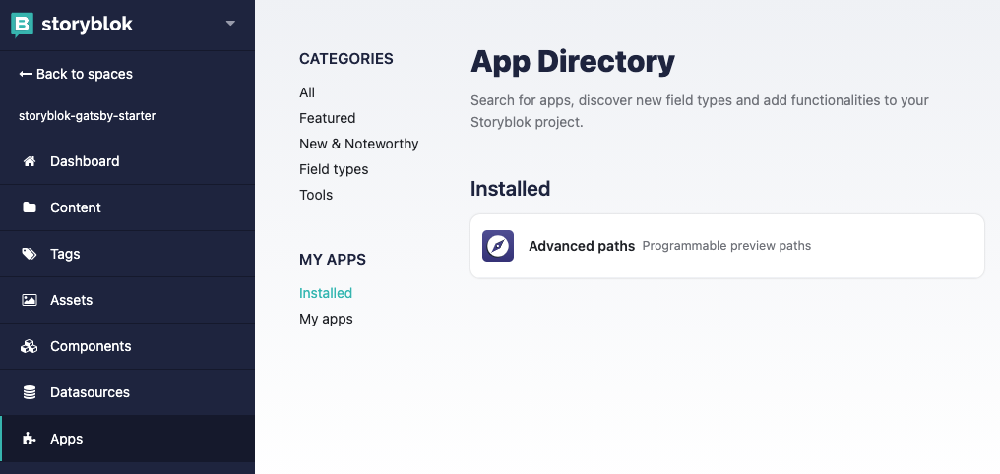
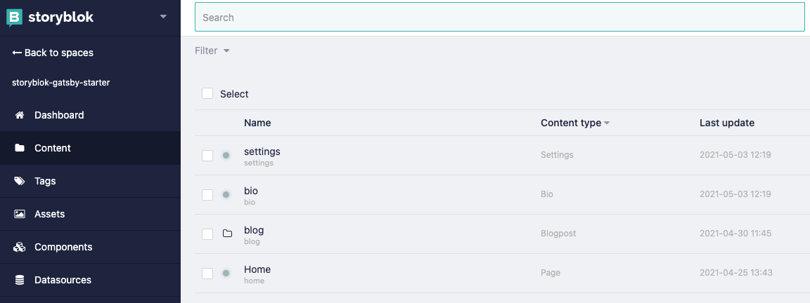
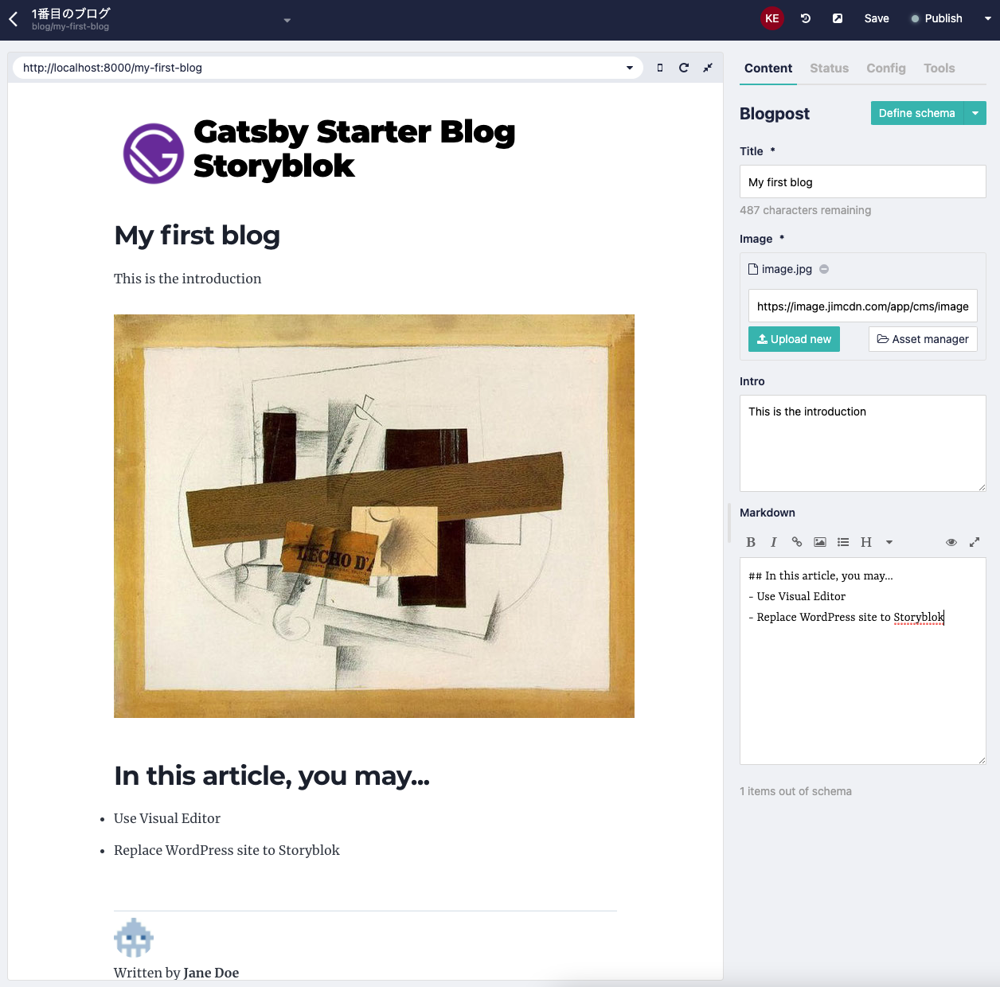

# Gatsby Starter Blog Storyblok

This is the example integration of [gatsby-starter-blog](https://github.com/gatsbyjs/gatsby-starter-blog) and [Storyblok](https://www.storyblok.com/). I assume you know some [Storyblok basics](https://www.storyblok.com/docs/guide/essentials/content-structures).

## 0. Prerequisites

### Create a space

First of all, [create a space](https://www.storyblok.com/docs/guide/getting-started#create-a-space) on Storyblok for this project (if not, there's no contents to be shown!).

### Define a schema

Next, [define a data schema](https://www.storyblok.com/docs/guide/getting-started#prepared-data-structure). In this repo assumes following data (**component**, `field`,...) can be fetched from Storyblok API.

- **/blog** (folder)
  - slug: 'blog'
  - real_path: ''
  - content_type: blogpost
    - `title` (text)
    - `image` (image)
    - `intro` (text)
    - `long_text` (markdown)
- **settings** (entry)
  - slug: 'settings'
  - real_path: ''
  - content_type: settings
    - `site_title` (text)
    - `site_img` (image)
    - `site_description` (text)
- **bio** (entry)
  - slug: 'bio'
  - real_path: ''
  - content_type: bio
    - `bio_img` (image)
    - `bio_msg` (markdown)
    - `bio_name` (text)

> **📖 NOTE**
>
>By default, `real_path` property of an entry (or folder) is disabled in settings panel. Please install **Advanced Paths** App on Storyblok to make it configurable:


If you have done, your `Content` page will be like this:




### Create contents

Create your contents.

### Get an API key

Get API key as written on [this article](https://www.storyblok.com/tp/gatsby-multilanguage-website-tutorial#connect-storyblok) and paste it on `gatsby-config.js`:

```js
module.exports = {
  ...
  plugins: [
    {
      resolve: "gatsby-source-storyblok",
      options: {
        accessToken: process.env.STORYBLOK_ACCESS_TOKEN, // <- set your own
        homeSlug: "home",
        version: process.env.NODE_ENV === "production" ? "published" : "draft",
      },
    },
    ...
  ],
}
```

## 1. Installation

Download and init this project:

```bash
gatsby new my-site https://kenchon.github.com/gatsby-starter-blog-storyblok
yarn # or `npm install`
```

## 2. Start dev server

```bash
yarn dev # or `npm run dev`
```

If you have finished `0. Prerequisites` properly, GraphQL fetch the stored contents and create static pages for you. For example, if you made blogpost whose slug is `my-first-post`, `/my-first-post/index.html` is created when `onCreatePage` API (which is defined at `gatsby-node.js`) is called.

Go to `localhost:8000/` and you'll find your contents are there!

## 3. Using Visual Editor

Go to your first blogpost page on Storyblok GUI (e.g. `Content > /blog > my-first-post`) and you'll find something like this:



In your blogpost page, following **editable comopnents** are shown:

- `<Header />`
- `<BlogPage />`
- `<Bio>`

Click them and edit the contents!
